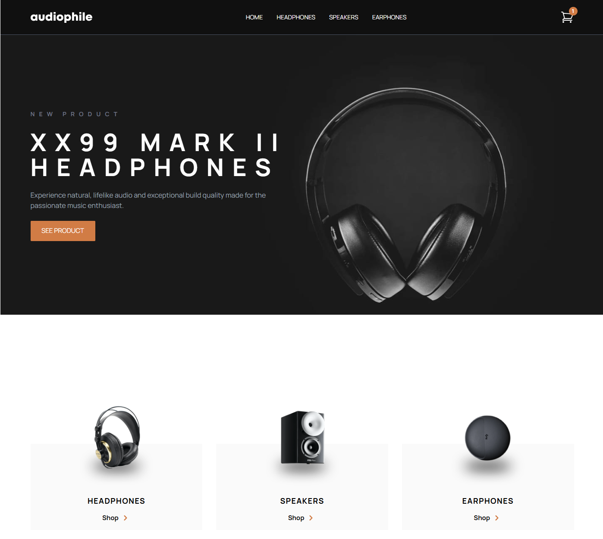

🛒 E‑Commerce Web App

This is a multi‑page e‑commerce web application built with React, Tailwind CSS, and React Context API. The project includes product categories, individual product detail pages, a shopping cart, and a checkout flow with a summary modal after completing the form and clicking Pay. It features smooth routing with React Router, modern UI/UX, and fade‑in animations on scroll.

🌍 Live Demo

You can view the deployed project here: https://e-commerce-audio1.netlify.app/

📸 Preview

Here’s a preview of the E‑Commerce Web App:

📌 Features

✅ Multi‑page structure using React Router✅ Context API for cart and product state management✅ Fully responsive design with Tailwind CSS✅ Dynamic product detail pages with features, gallery, and included items✅ Shopping cart with add/remove items and quantity updates✅ Checkout page with validation and order summary✅ Modal confirmation after placing an order✅ Reusable and modular React components✅ Smooth fade‑in animations on scroll✅ Modern, clean, and responsive UI/UX design

🛠️ Tech Stack

React – For building UI componentsReact Router – For multi‑page navigationReact Context API – For global cart state managementTailwind CSS – For styling and responsive designReact Hooks – For managing component logic and stateJSON Data – For dynamic product rendering

🚀 Installation & Setup

Clone the repository:

git clone https://github.com/Konrad2502/Ecommerce-Web-App.git
cd Ecommerce-Web-App

Install dependencies:

npm install

Start the development server:

npm start

Open http://localhost:3000 in your browser to view the project.

📜 Available Scripts

npm start – Runs the app in development modenpm test – Launches the test runnernpm run build – Builds the app for productionnpm run preview – Previews the production build locally (if using Vite)

📚 What I Learned

This project helped me deepen my knowledge of:

🎯 React Router – Implementing advanced multi‑page navigation🎯 React Context API – Managing global cart state effectively🎯 Tailwind CSS – Building fast, responsive, and modern UI🎯 Checkout Flow – Designing forms, validations, and order summary🎯 Reusable Components – Structuring scalable UI elements🎯 Animations – Adding smooth fade‑in effects on scroll for better UX🎯 E‑Commerce Logic – Cart operations, totals, and confirmation modals

📬 Contact

If you have any questions, feel free to reach out:

🔗 GitHub: Konrad2502✉️ Email: konrad.litak@gmail.com

